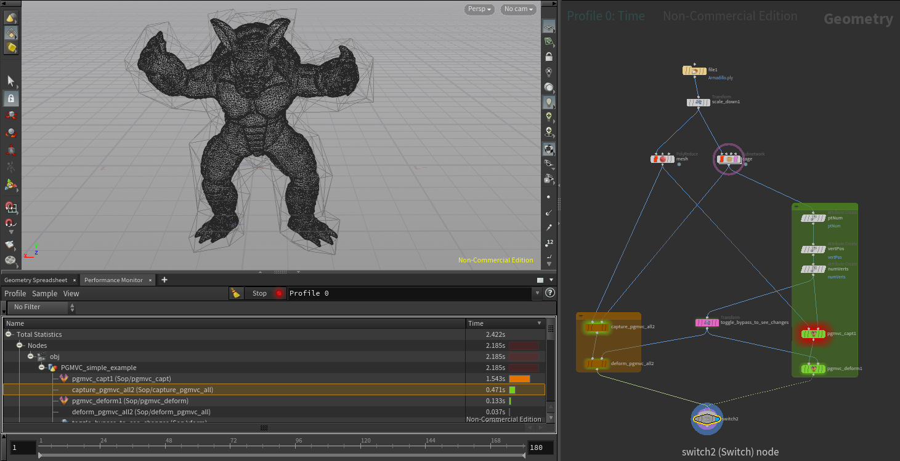

# HDK version of Mean Value Coordinates deformer with TBB.

[](./images/demo1.mp4)

This projects tests how well different paralization strategies and libraries (TBB, OpenMP) scale scale and impacts throughput. 

The capture node is a rewrite of a previous hybrid implementation (HDK/For each sop ) found on OdForce (see the references) 

References:
- https://www.cse.wustl.edu/~taoju/research/meanvalue.pdf
- https://forums.odforce.net/topic/8877-gmvc-general-mean-value-coordinates/?page=2

## Build

```
mkdir -p __build && cd "$_"
cmake .. -DCMAKE_INSTALL_PREFIX=~/houdini18.0/
make install
```

## Test
```
source  ~/hfs18.0.416/houdini_setup
run -foreground -n  $HOME/PRJ/pgmvc/example.hipnc
```

## Debug
```
env_gcc650  # building with more 7.5.0 gcc leaks while debugging in gdb
cmake .. -DCMAKE_BUILD_TYPE=Debug -DCMAKE_CXX_FLAGS="-g -O0"

gdb bin/hmaster-bin 
run -foreground -n  $HOME/PRJ/pgmvc/example.hipnc
b SOP_PGMVC_captAtt::cookMySop
```


### example .cquery setup

```
%clang

-I$HOME/hfs18.0.416/toolkit/include
```

### Benchmark
  
| 10000 points - i5-2520M CPU @ 2.50GHz | outer loop | inner loop |
|------------------------|------------|------------|
|                   19.8 | serial     | serial     |
|                   12.0 | tbb        | serial     |
|                    8.7 | tbb        | serial     |
|                   10.5 | openmp     | tbb        |
|                    8.3 | tbb        | tbb        |
